# CppColDB — Architecture Diagrams

Mermaid diagrams covering system architecture, query execution, storage internals, transactions, and pipeline operator flow.

---

## 1. System Architecture (C4 Container)

High-level view of deployable units and their interactions.

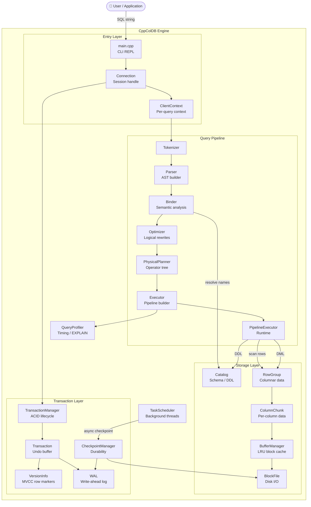

---

## 2. Query Execution Flow (Sequence)

Full lifecycle from SQL string to result rows.

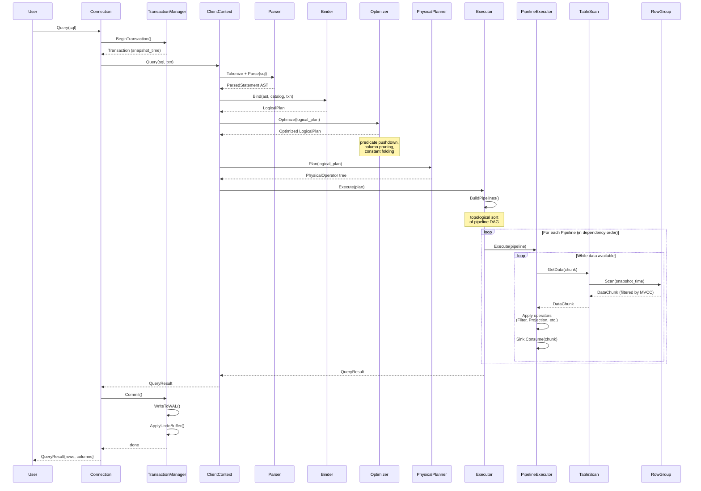

---

## 3. Pipeline Operator Roles

How operators are organized into pipelines for two-phase operations.

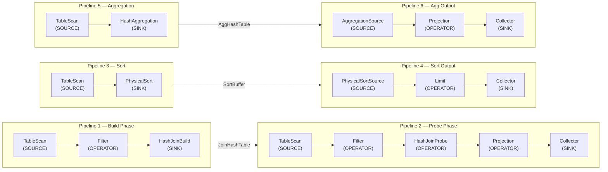

---

## 4. Storage Layer Internals

Column-oriented storage with compression and buffer management.

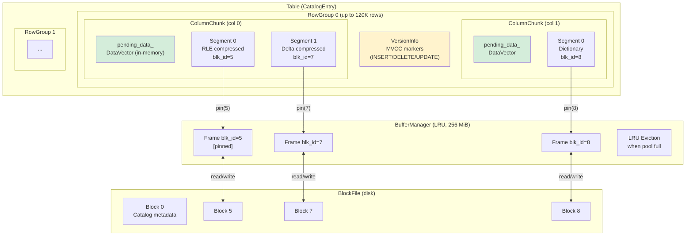

---

## 5. MVCC Transaction Lifecycle (State)

Transaction states and visibility rules.

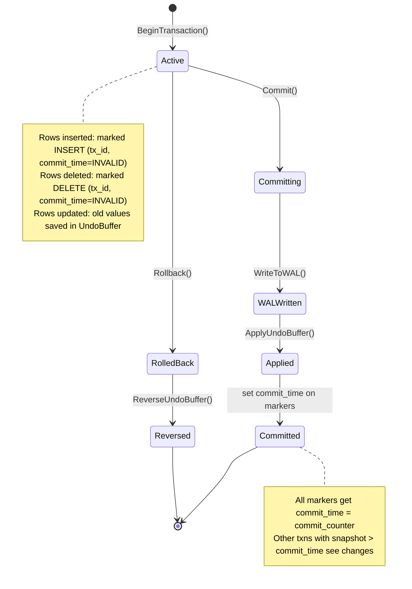

---

## 6. MVCC Row Visibility

How snapshot isolation decides which rows a transaction sees.

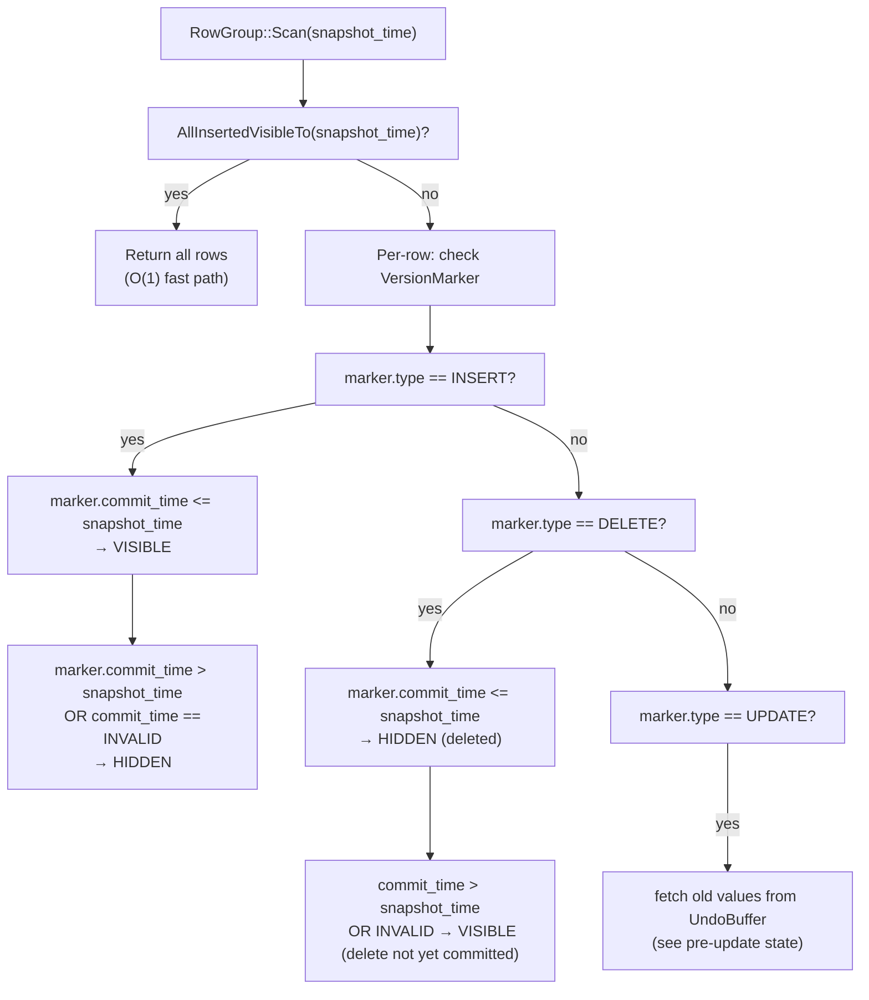

---

## 7. WAL & Recovery Flow

Durability path from commit to crash recovery.

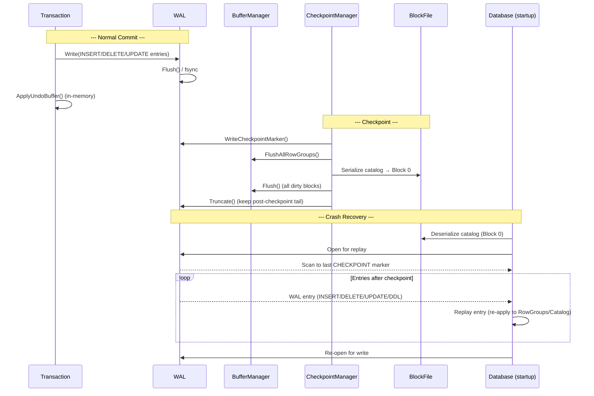

---

## 8. Partitioning — Routing & Pruning

How rows are routed on insert and partitions are pruned on scan.

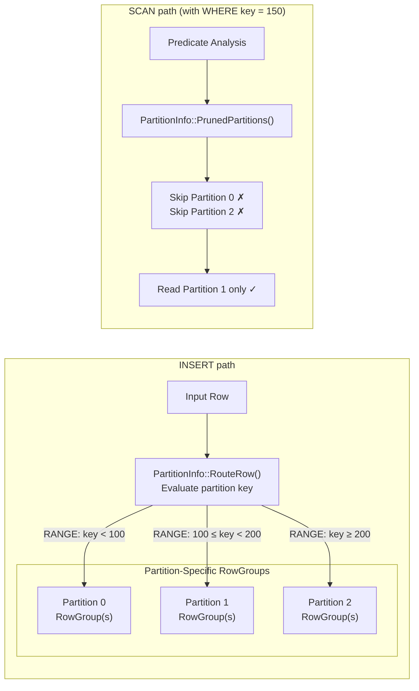

---

## 9. Logical → Physical Plan Mapping

How logical plan nodes become physical operator trees.

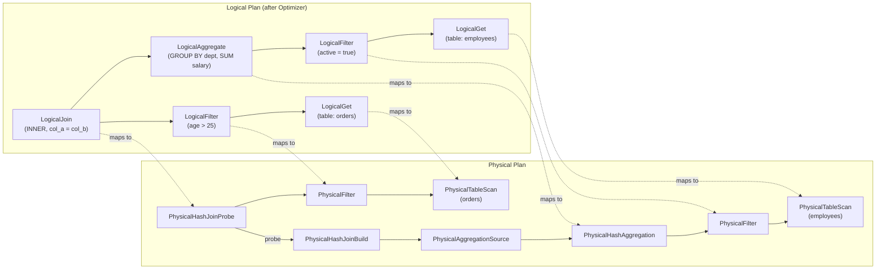

---

## 10. Class Hierarchy — Physical Operators

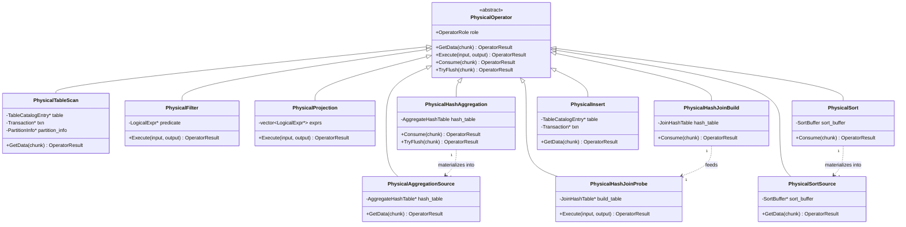

---

## 11. Data Model — Storage Entities (ER)

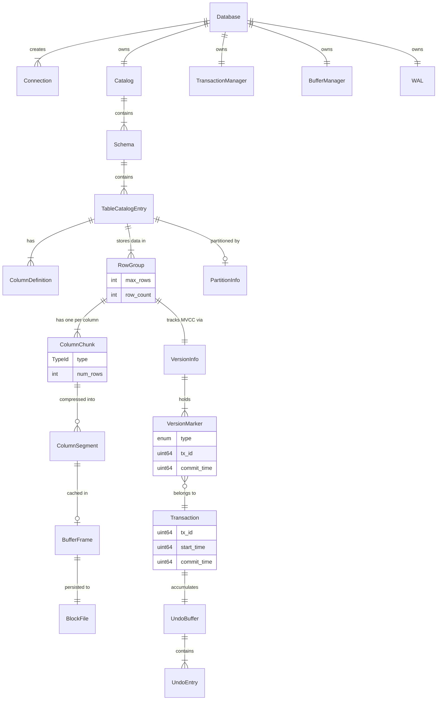
