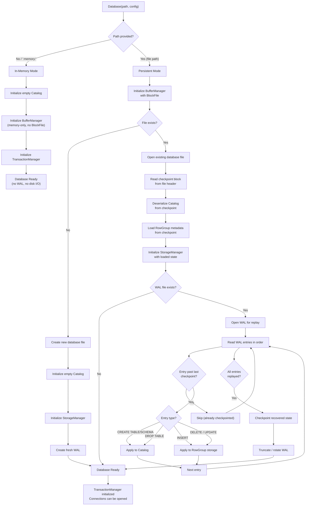

# Database Initialization Flow

## Assumptions
- Database constructor is the primary entry point.
- Two paths: in-memory database (no file) and persistent file database.
- On startup with an existing file, the WAL is replayed for crash recovery.
- Catalog is loaded from the checkpoint file before WAL replay.

## Diagram

## Planned Implementation
- `src/main/database.cpp` — Database constructor, init sequence
- `src/storage/storage_manager.cpp` — StorageManager::Load()
- `src/storage/wal_replay.cpp` — WAL replay logic
- `src/catalog/catalog.cpp` — Catalog deserialization
