# Database Shutdown Flow

## Assumptions
- Shutdown is triggered when the Database object is destroyed.
- All open connections are closed and their transactions rolled back before storage is flushed.
- A final checkpoint may be performed if there is unflushed WAL data.

## Diagram

```mermaid
flowchart TD
    A["Database destructor called"] --> B["Signal shutdown\nto all subsystems"]

    B --> C["--- Close Connections ---"]
    C --> D["For each open Connection"]
    D --> E{"Has active\ntransaction?"}
    E -- Yes --> F["TransactionManager::\nRollback(transaction)"]
    F --> G["Transaction rolled back"]
    E -- No --> G
    G --> H{"More open\nconnections?"}
    H -- Yes --> D
    H -- No --> I["All connections closed"]

    I --> J["--- Flush WAL ---"]
    J --> K{"In-memory\ndatabase?"}
    K -- Yes --> N["Skip WAL flush"]
    K -- No --> L{"WAL has\npending entries?"}
    L -- No --> N
    L -- Yes --> M["WAL::Flush()\nfsync WAL file"]
    M --> N

    N --> O["--- Checkpoint if needed ---"]
    O --> P{"WAL size above\ncheckpoint threshold?"}
    P -- Yes --> Q["CheckpointManager::\nCreateCheckpoint()"]
    Q --> R["Flush dirty ColumnChunks\nto BlockFile"]
    R --> S["Write Catalog snapshot\nto file header"]
    S --> T["Truncate WAL"]
    T --> U["Checkpoint done"]
    P -- No --> U

    U --> V["--- Release Buffer Pool ---"]
    V --> W["BufferManager::Shutdown()"]
    W --> X["Unpin and evict\nall in-memory blocks"]
    X --> Y["Close BlockFile"]

    Y --> Z["--- Destroy Subsystems ---"]
    Z --> Z1["Destroy CheckpointManager"]
    Z1 --> Z2["Destroy WAL"]
    Z2 --> Z3["Destroy TransactionManager"]
    Z3 --> Z4["Destroy Catalog"]
    Z4 --> Z5["Destroy BufferManager"]
    Z5 --> AA["Database shutdown complete"]
```

## Planned Implementation
- `src/main/database.cpp` — Database destructor
- `src/transaction/transaction_manager.cpp` — TransactionManager::Rollback()
- `src/storage/wal.cpp` — WAL::Flush()
- `src/storage/checkpoint_manager.cpp` — CheckpointManager::CreateCheckpoint()
- `src/storage/buffer_manager.cpp` — BufferManager::Shutdown()
