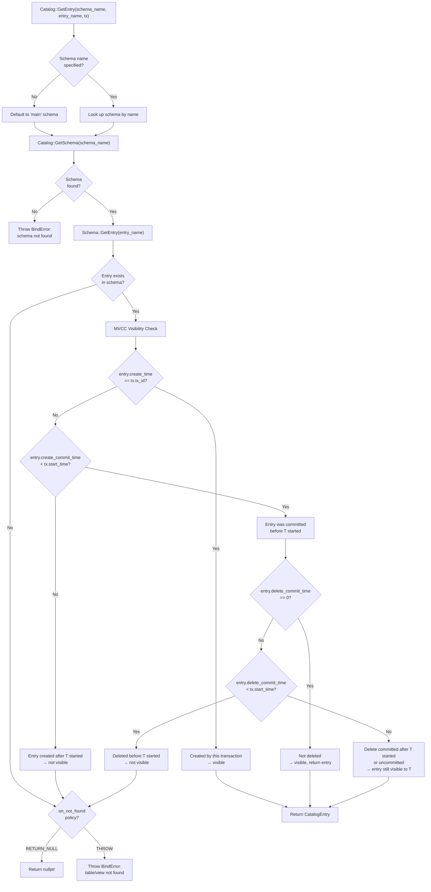

# Catalog Lookup Flow

## Assumptions
- The Catalog is organized as: Catalog → Schema → CatalogEntry (table, view, column).
- Lookups are MVCC-aware: only entries visible to the current transaction are returned.
- An entry is visible if its commit_time is before the transaction's start_time, or it was created by the same transaction.
- A deleted entry (marked with a delete_time) is invisible if the delete was committed before the transaction started.

## Diagram

## Planned Implementation
- `src/catalog/catalog.cpp` — Catalog::GetEntry(), GetSchema()
- `src/catalog/schema.cpp` — Schema::GetEntry()
- `src/catalog/catalog_entry.cpp` — CatalogEntry with create/delete timestamps
- `src/transaction/transaction.cpp` — Transaction::IsVisible(entry)
