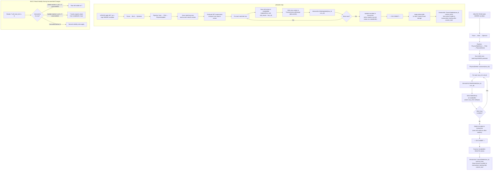

# Delete & Update Data Flow

## Assumptions
- DELETE and UPDATE use MVCC version markers rather than in-place modification.
- Deletes write a delete marker into VersionInfo; updates save old values in UndoBuffer.
- Other transactions reading during an uncommitted delete/update see the original data.
- On commit, delete markers and update version timestamps become permanent.

## Diagram

## Planned Implementation
- `src/execution/operator/physical_delete.cpp` — PhysicalDelete::Consume()
- `src/execution/operator/physical_update.cpp` — PhysicalUpdate::Consume()
- `src/storage/column/version_info.cpp` — MarkDeleted(), CommitDelete(), MarkUpdated(), CommitUpdate()
- `src/transaction/undo_buffer.cpp` — DeleteEntry, UpdateEntry storage
- `src/transaction/transaction_manager.cpp` — Commit() delete/update application
