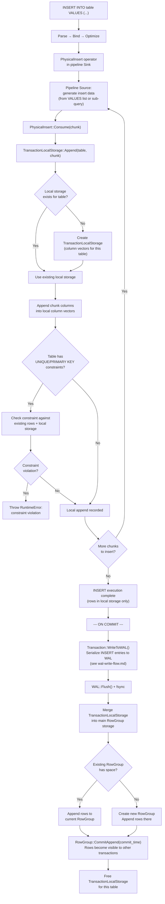

# Insert Data Flow

## Assumptions
- INSERT goes through the full query pipeline: parse → bind → optimize → physical plan → execute.
- During execution, new rows are written to TransactionLocalStorage (column vectors private to the transaction).
- On commit, the local storage is merged into the main RowGroup storage, making rows visible to others.
- The WAL entry is written during commit, before the merge.

## Diagram

## Planned Implementation
- `src/execution/operator/physical_insert.cpp` — PhysicalInsert::Consume()
- `src/transaction/transaction_local_storage.cpp` — TransactionLocalStorage::Append()
- `src/transaction/transaction_manager.cpp` — Commit() → merge local storage
- `src/storage/column/row_group.cpp` — RowGroup::Append(), CommitAppend()
- `src/storage/wal.cpp` — WAL insert serialization
