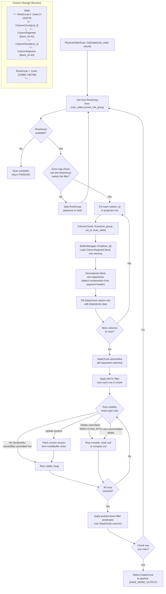

# Table Scan Flow (Column-Oriented)

## Assumptions
- Table scans are the primary Source operator in query pipelines.
- Data is stored column-by-column in RowGroups; only the requested columns are read (column pruning).
- Each ColumnChunk is loaded from the BufferManager and decompressed into a DataVector.
- MVCC filtering is applied per-row after assembling the DataChunk.
- Zone maps (min/max statistics per ColumnChunk) allow entire RowGroups to be skipped.

## Diagram

## Planned Implementation
- `src/execution/operator/physical_table_scan.cpp` — PhysicalTableScan::GetData()
- `src/storage/column/row_group.cpp` — RowGroup scan coordination
- `src/storage/column/column_chunk.cpp` — ColumnChunk::Scan()
- `src/storage/buffer_manager.cpp` — BufferManager::Pin()
- `src/storage/column/compression.cpp` — Decompress into DataVector
