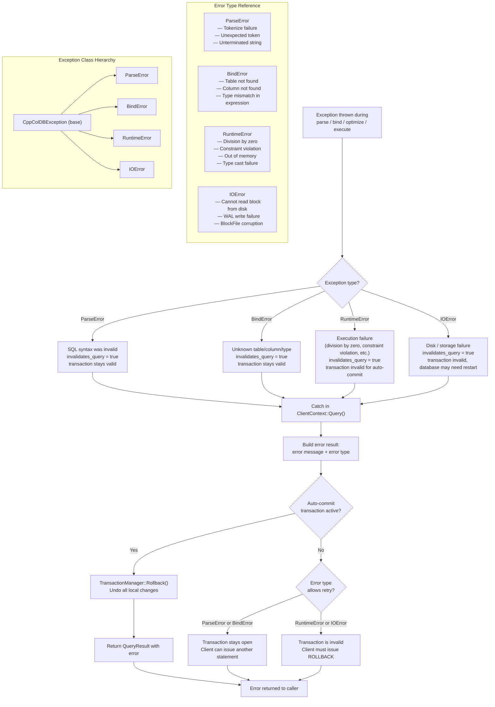

# Error Handling Flow

## Assumptions
- CppColDB uses C++ exceptions for error propagation; no error code threading.
- Errors are classified by type: ParseError, BindError, RuntimeError, IOError.
- On any unhandled error during query execution, the current transaction is rolled back.
- Auto-commit queries rollback automatically; explicit transactions require a client ROLLBACK.

## Diagram

## Planned Implementation
- `src/common/exception.cpp` — CppColDBException, ParseError, BindError, RuntimeError, IOError
- `src/main/client_context.cpp` — top-level catch in Query()
- `src/transaction/transaction_manager.cpp` — Rollback() on error path
