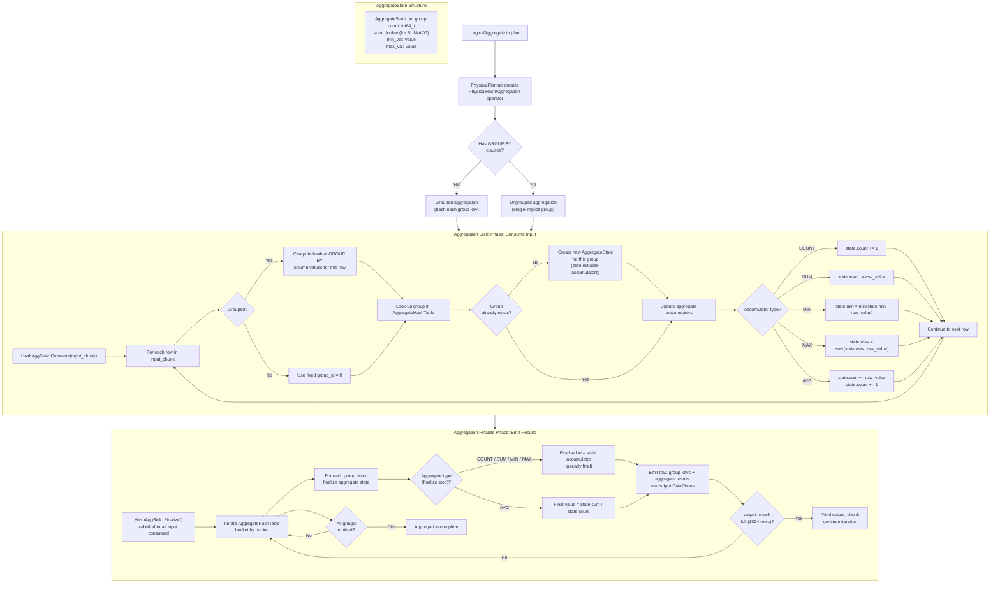

# Aggregation Flow

## Assumptions
- CppColDB uses hash aggregation for grouped aggregates (GROUP BY).
- Ungrouped aggregates (no GROUP BY) are a degenerate case handled by the same operator with a single group.
- Aggregate state is stored per group key in an AggregateHashTable.
- After all input is consumed, the hash table is iterated to finalize and emit result chunks.

## Diagram

## Planned Implementation
- `src/execution/operator/hash_aggregation.cpp` — HashAggSink::Consume(), Finalize()
- `src/execution/aggregate_hash_table.cpp` — AggregateHashTable, AggregateState management
- `src/execution/aggregate_functions.cpp` — per-type accumulator update and finalize logic
- `src/planner/physical_planner.cpp` — PhysicalHashAggregation creation
