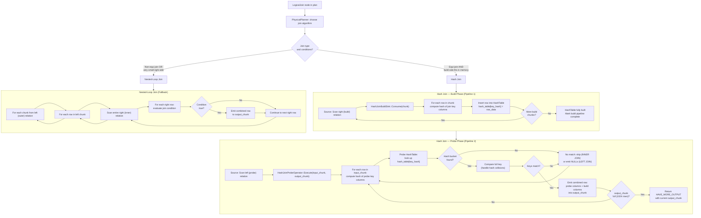

# Join Execution Flow

## Assumptions
- The primary join algorithm is hash join (build + probe phases).
- Hash join is implemented as two pipelines: one to build the hash table, one to probe it.
- Nested-loop join is available as a fallback for non-equi joins or small relations.
- Join output is vectorized: matching rows are emitted as DataChunks.

## Diagram

## Planned Implementation
- `src/execution/operator/hash_join_build.cpp` — HashJoinBuildSink, HashTable construction
- `src/execution/operator/hash_join_probe.cpp` — HashJoinProbeOperator, probe logic
- `src/execution/operator/nested_loop_join.cpp` — NestedLoopJoin fallback
- `src/execution/hash_table.cpp` — HashTable data structure
- `src/planner/physical_planner.cpp` — join algorithm selection
