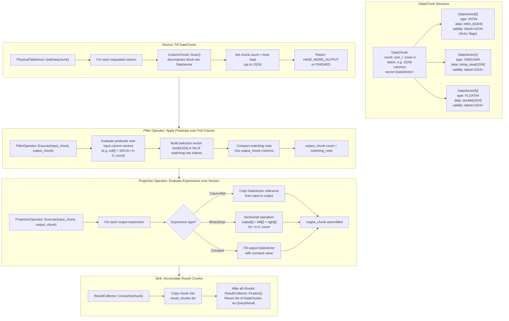

# Vectorized Execution Flow

## Assumptions
- CppColDB uses vectorized (columnar batch) execution: operators process DataChunks of up to 1024 rows.
- Each DataChunk holds a vector of DataVectors (one per column), plus a row count.
- Processing a whole batch of values per column call enables SIMD-friendly code and better cache usage.
- Operators never process one row at a time in the hot path.

## Diagram

## Key Performance Properties
- Processing 1024 rows per call amortizes function call overhead
- Column vectors fit in CPU cache (1024 * 8 bytes = 8 KB per INT64 column)
- Predicate evaluation over a full column vector enables compiler auto-vectorization (SIMD)
- NULL handling via validity bitmask avoids branches in the hot loop

## Planned Implementation
- `src/common/data_chunk.cpp` — DataChunk, DataVector
- `src/execution/operator/filter_operator.cpp` — vectorized predicate evaluation
- `src/execution/operator/projection_operator.cpp` — vectorized expression evaluation
- `src/execution/operator/result_collector.cpp` — result accumulation sink
