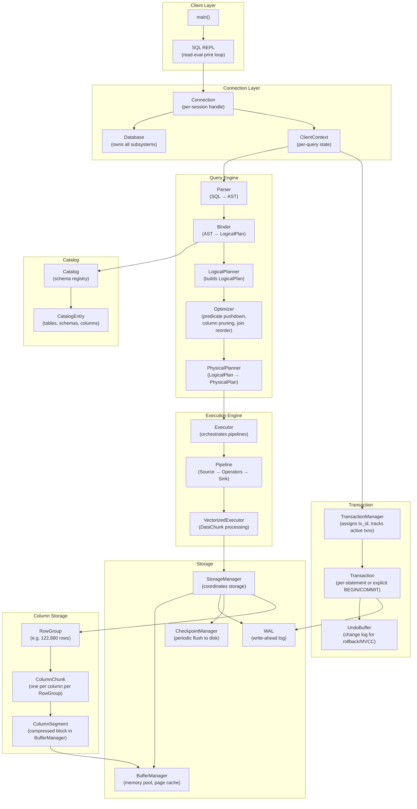

# CppColDB System Architecture Overview

## Assumptions
- Single-node, single-process column-oriented database
- All subsystems communicate through well-defined interfaces
- Storage is either in-memory or single-file persistent

## Diagram

## Key Design Principles
- Vectorized execution: operators process DataChunks (batches of ~1024 column vectors), not individual rows
- Column-oriented storage: data stored column-by-column within RowGroups for efficient scans and compression
- MVCC: each transaction sees a consistent snapshot; changes buffered in UndoBuffer until commit
- WAL-first writes: all persistent changes written to WAL before being applied to storage
- Buffer-managed I/O: all disk access goes through BufferManager for memory control

## Planned Implementation
- `src/main/database.cpp` — Database, Connection
- `src/main/client_context.cpp` — ClientContext
- `src/parser/` — Parser, Tokenizer, AST nodes (ParsedStatement)
- `src/planner/` — Binder, LogicalPlanner, PhysicalPlanner
- `src/optimizer/` — Optimizer passes
- `src/execution/` — Executor, Pipeline, VectorizedExecutor
- `src/storage/` — StorageManager, BufferManager, WAL, CheckpointManager
- `src/catalog/` — Catalog, CatalogEntry
- `src/transaction/` — TransactionManager, Transaction, UndoBuffer
- `src/storage/column/` — RowGroup, ColumnChunk, ColumnSegment
