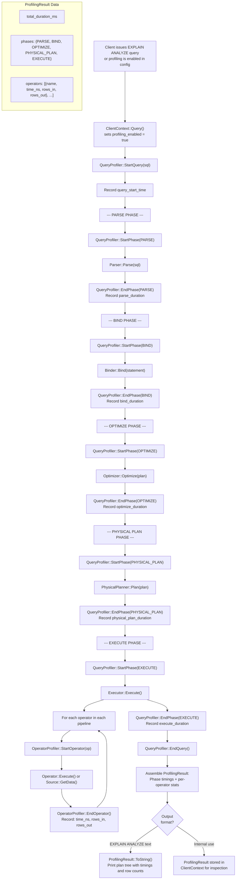

# Query Profiling Flow

## Assumptions
- Profiling is opt-in per connection via a configuration flag or EXPLAIN ANALYZE.
- The QueryProfiler records wall-clock time for each major query phase.
- Operator-level timing is tracked per pipeline operator during execution.
- EXPLAIN ANALYZE triggers profiling for a single query and prints the result.

## Diagram

## Planned Implementation
- `src/main/query_profiler.cpp` — QueryProfiler, StartPhase(), EndPhase(), StartQuery(), EndQuery()
- `src/execution/operator_profiler.cpp` — per-operator timing
- `src/main/client_context.cpp` — profiling integration in Query()
- `src/main/explain.cpp` — EXPLAIN ANALYZE output formatting
