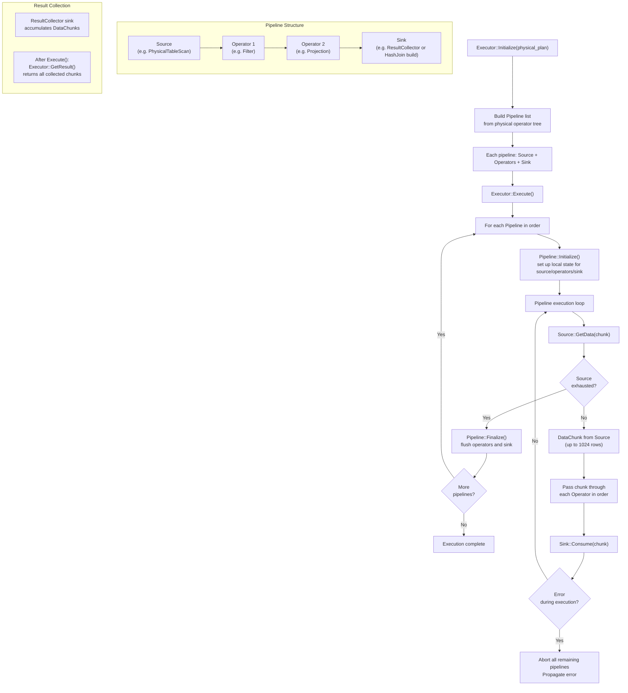

# Pipeline Execution Flow

## Assumptions
- CppColDB uses a single-threaded pipeline model for simplicity; no parallel task scheduling within a query.
- Executor initializes one or more pipelines from the physical plan.
- Each pipeline runs to completion before the next starts (unless pipelined).
- Background tasks (checkpoint, compaction) use the thread pool but are separate from query execution.

## Diagram

## Planned Implementation
- `src/execution/executor.cpp` — Executor::Initialize(), Execute(), GetResult()
- `src/execution/pipeline.cpp` — Pipeline, Pipeline::Initialize(), Finalize()
- `src/execution/physical_operator.cpp` — PhysicalOperator base class (Source/Operator/Sink roles)
