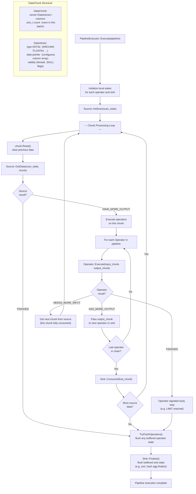

# Pipeline Executor (Per-Pipeline) Flow

## Assumptions
- A PipelineExecutor processes one pipeline: Source produces DataChunks, each Operator transforms them, Sink consumes the result.
- Vectorized chunk-at-a-time model: all operators process a full DataChunk (up to 1024 rows) per call.
- Each operator maintains local state (e.g. hash table, sort buffer) initialized before the loop.

## Diagram

## Planned Implementation
- `src/execution/pipeline_executor.cpp` — PipelineExecutor::Execute()
- `src/execution/physical_operator.cpp` — GetData(), Execute(), Consume(), Finalize()
- `src/common/data_chunk.cpp` — DataChunk, DataVector
