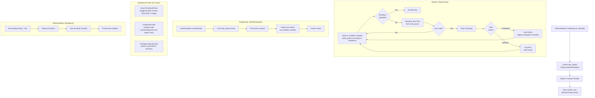

# Task Scheduler Flow

## Assumptions
- CppColDB uses a simple thread pool for background tasks only (checkpointing, compaction).
- Query execution itself is single-threaded; the thread pool is not used for pipeline execution.
- Worker threads pull tasks from a shared task queue.
- Tasks are submitted by the foreground thread (e.g. on commit, trigger async checkpoint).

## Diagram

## Planned Implementation
- `src/parallel/task_scheduler.cpp` — TaskScheduler, worker thread loop
- `src/parallel/task.cpp` — Task base class
- `src/storage/checkpoint_manager.cpp` — AsyncCheckpointTask
