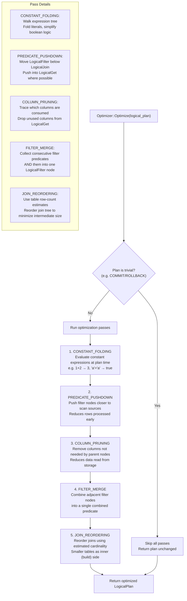

# Optimizer Pipeline Flow

## Assumptions
- The optimizer operates on the LogicalPlan and returns a transformed LogicalPlan.
- Passes are applied in a fixed order; each pass is a separate optimizer rule.
- The optimizer is intentionally simple — it covers the most impactful optimizations without complexity.
- Individual passes can be disabled for debugging.

## Diagram

## Planned Implementation
- `src/optimizer/optimizer.cpp` — Optimizer::Optimize(), pass dispatch
- `src/optimizer/constant_folding.cpp` — constant folding pass
- `src/optimizer/predicate_pushdown.cpp` — predicate pushdown pass
- `src/optimizer/column_pruning.cpp` — column pruning pass
- `src/optimizer/filter_merge.cpp` — filter merge pass
- `src/optimizer/join_reordering.cpp` — join reordering pass
