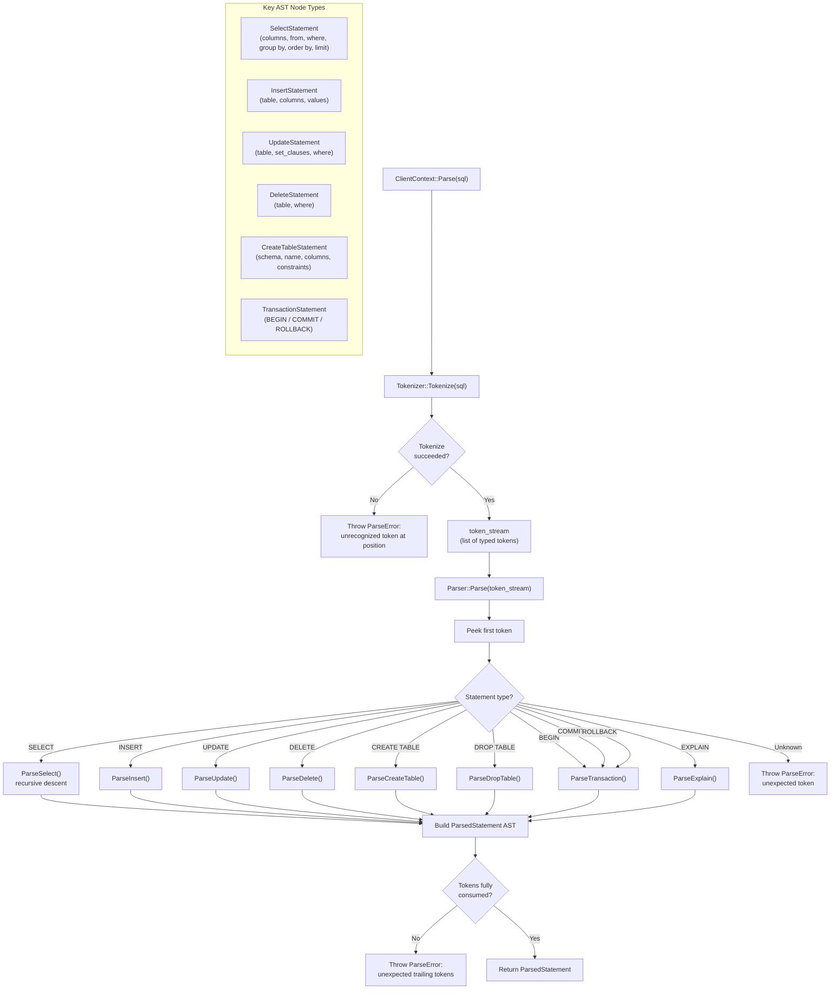

# SQL Parsing Flow

## Assumptions
- CppColDB uses a hand-written recursive descent parser; no third-party parser library.
- The Tokenizer converts the raw SQL string into a token stream.
- The Parser walks the token stream and builds a typed AST (ParsedStatement).
- Single-statement focus: one SQL string produces one ParsedStatement.

## Diagram

## Planned Implementation
- `src/parser/tokenizer.cpp` — Tokenizer, Token types
- `src/parser/parser.cpp` — Parser, recursive descent methods
- `src/parser/ast/` — AST node types (ParsedStatement and subtypes)
