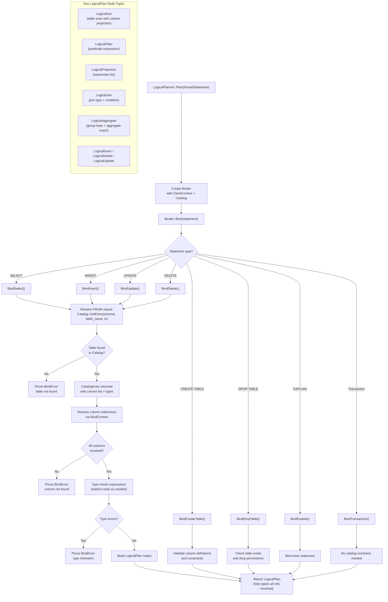

# Planner & Binding Flow

## Assumptions
- The Binder takes the parsed AST and resolves all table/column references against the Catalog.
- Binding fails with a BindError if a referenced table or column does not exist.
- The output of binding is a fully typed LogicalPlan.
- The LogicalPlanner coordinates the overall planner → binder → plan construction sequence.

## Diagram

## Planned Implementation
- `src/planner/logical_planner.cpp` — LogicalPlanner::Plan()
- `src/planner/binder.cpp` — Binder::Bind(), BindContext
- `src/catalog/catalog.cpp` — Catalog::GetEntry()
- `src/planner/logical_plan/` — LogicalPlan node types
