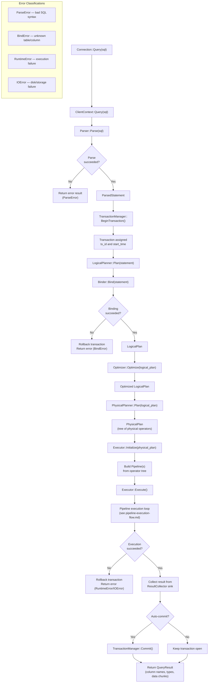

# Query Execution Flow

## Assumptions
- Full path from Connection::Query() through parse → bind → optimize → physical plan → execute.
- Auto-commit: a transaction is started before execution and committed (or rolled back) after.
- Single-statement focus: one SQL string produces one result.

## Diagram

## Planned Implementation
- `src/main/connection.cpp` — Connection::Query()
- `src/main/client_context.cpp` — ClientContext::Query()
- `src/parser/parser.cpp` — Parser::Parse()
- `src/planner/logical_planner.cpp` — LogicalPlanner::Plan()
- `src/optimizer/optimizer.cpp` — Optimizer::Optimize()
- `src/planner/physical_planner.cpp` — PhysicalPlanner::Plan()
- `src/execution/executor.cpp` — Executor::Initialize(), Execute()
