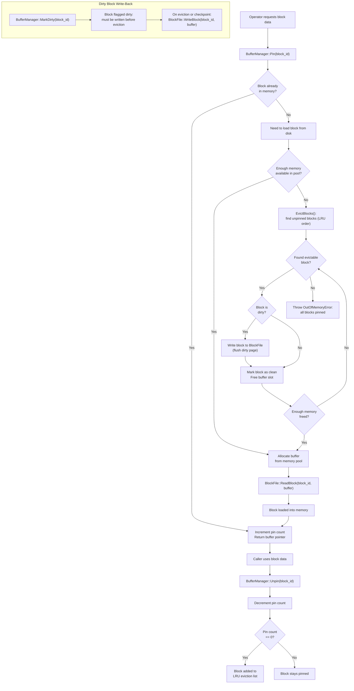

# Buffer Manager Flow

## Assumptions
- The BufferManager manages a fixed-size pool of in-memory pages (blocks).
- All disk I/O goes through the BufferManager; no operator accesses BlockFile directly.
- Blocks are identified by block_id. A pin keeps a block in memory; an unpin makes it evictable.
- When memory is full, unpinned blocks are evicted using an LRU policy.

## Diagram

## Planned Implementation
- `src/storage/buffer_manager.cpp` — BufferManager, Pin(), Unpin(), EvictBlocks()
- `src/storage/block_manager.cpp` — BlockManager, BlockFile (disk I/O)
- `src/storage/buffer/buffer_pool.cpp` — memory pool, LRU eviction tracking
