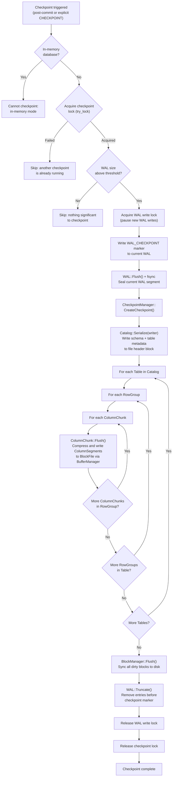

# Checkpoint Flow

## Assumptions
- A checkpoint writes the current in-memory database state to the persistent file, then truncates the WAL.
- Checkpoints are triggered automatically when the WAL exceeds a size threshold, or explicitly.
- A checkpoint lock ensures only one checkpoint runs at a time.
- In-memory databases never checkpoint.

## Diagram

## Planned Implementation
- `src/storage/checkpoint_manager.cpp` — CheckpointManager::CreateCheckpoint()
- `src/storage/storage_manager.cpp` — checkpoint trigger logic
- `src/storage/wal.cpp` — WAL::Truncate()
- `src/storage/column/column_chunk.cpp` — ColumnChunk::Flush()
- `src/catalog/catalog.cpp` — Catalog::Serialize()
