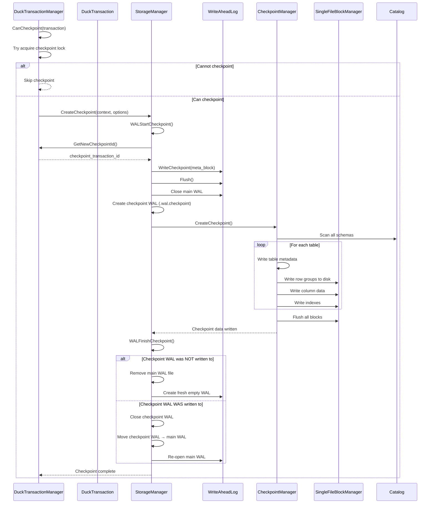

# Checkpoint Sequence Diagram

## Assumptions
- Shows the interaction between components during an automatic checkpoint triggered by a commit.
- The WAL lock is held separately from the transaction lock to allow concurrent reads.
- The checkpoint WAL captures any writes that happen during the checkpoint process.

## Code Files Referenced
- `src/transaction/duck_transaction_manager.cpp` — `CommitTransaction()` checkpoint decision
- `src/storage/storage_manager.cpp` — `WALStartCheckpoint()`, `WALFinishCheckpoint()`
- `src/storage/checkpoint_manager.cpp` — `CheckpointManager::CreateCheckpoint()`

