# Column Chunk Flow

## Assumptions
- Tables are partitioned horizontally into RowGroups of a fixed row count (e.g. 122,880 rows).
- Within each RowGroup, each column has exactly one ColumnChunk.
- A ColumnChunk contains one or more ColumnSegments (compressed blocks stored in the BufferManager).
- ColumnSegments are the unit of I/O: one segment maps to one block in the BlockFile.

## Diagram

```mermaid
flowchart TD
    subgraph TableLayout["Table Physical Layout"]
        T["Table: orders"]
        T --> RG0["RowGroup 0\n(rows 0–122,879)"]
        T --> RG1["RowGroup 1\n(rows 122,880–245,759)"]
        T --> RGN["RowGroup N\n(rows ...)"]

        RG0 --> CC0A["ColumnChunk[order_id]\n(INT64)"]
        RG0 --> CC0B["ColumnChunk[customer_id]\n(INT64)"]
        RG0 --> CC0C["ColumnChunk[amount]\n(FLOAT64)"]
        RG0 --> CC0D["ColumnChunk[status]\n(VARCHAR)"]

        CC0A --> CS0A["ColumnSegment 0\nblock_id=10, compressed=true\n(bit-packed INT64)"]
        CC0B --> CS0B["ColumnSegment 0\nblock_id=11, compressed=true\n(delta encoded)"]
        CC0C --> CS0C["ColumnSegment 0\nblock_id=12, uncompressed\n(raw FLOAT64 array)"]
        CC0D --> CS0D["ColumnSegment 0\nblock_id=13, compressed=true\n(dictionary encoded)"]
    end

    subgraph ReadPath["ColumnChunk Read Path"]
        R1["ColumnChunk::Scan(scan_state, output_vector)"]
        R1 --> R2["Find current ColumnSegment\n(based on scan_state.row_offset)"]
        R2 --> R3["BufferManager::Pin(segment.block_id)"]
        R3 --> R4{"Block in memory?"}
        R4 -- No --> R5["BlockFile::ReadBlock(block_id, buffer)"]
        R5 --> R4
        R4 -- Yes --> R6["Decompress segment block\ninto DataVector\n(see column-compression-flow.md)"]
        R6 --> R7["Copy/reference values\ninto output_vector"]
        R7 --> R8["BufferManager::Unpin(segment.block_id)"]
        R8 --> R9["Advance scan_state.row_offset"]
    end

    subgraph WritePath["ColumnChunk Write Path (on Commit / Checkpoint)"]
        W1["ColumnChunk::Flush(writer)"]
        W1 --> W2["Collect buffered column values\nfrom TransactionLocalStorage"]
        W2 --> W3["Analyze values:\nchoose compression scheme\n(see column-compression-flow.md)"]
        W3 --> W4["Compress into byte buffer"]
        W4 --> W5["BufferManager::AllocateBlock()\nGet a new block_id"]
        W5 --> W6["Write compressed bytes\nto block buffer"]
        W6 --> W7["BufferManager::MarkDirty(block_id)\nSchedule for write to BlockFile"]
        W7 --> W8["Record ColumnSegment metadata:\nblock_id, compression_type, row_count, min/max stats"]
    end
```

## Key Design Decisions
- RowGroup size of ~122,880 rows (120 * 1024) balances memory use and scan granularity
- One ColumnSegment per block allows independent eviction of individual column blocks
- Zone maps (min/max per ColumnChunk) enable RowGroup skipping during filtered scans
- ColumnChunks for different columns of the same RowGroup are independent blocks, enabling column pruning

## Planned Implementation
- `src/storage/column/row_group.cpp` — RowGroup, per-column ColumnChunk ownership
- `src/storage/column/column_chunk.cpp` — ColumnChunk::Scan(), Flush()
- `src/storage/column/column_segment.cpp` — ColumnSegment metadata (block_id, compression, stats)
- `src/storage/buffer_manager.cpp` — block pin/unpin/alloc
