# Column Compression Flow

## Assumptions
- Compression is chosen per ColumnSegment at write time based on the data's value distribution.
- Each ColumnSegment stores a compression_type flag in its header so the reader can decompress correctly.
- Decompression always produces a contiguous DataVector of the column's logical type.
- Compression is transparent to operators — they always see decompressed DataVectors.

## Diagram

```mermaid
flowchart TD
    subgraph WriteCompression["Write Path: Choose and Apply Compression"]
        W1["ColumnChunk::Flush(values: DataVector)"] --> W2["Analyze value distribution\n(scan all values in segment)"]

        W2 --> W3{"Column type?"}

        W3 -- "INTEGER types\n(INT8, INT16, INT32, INT64)" --> W4{"Value range\nanalysis"}
        W4 --> W4A{"All values\nidentical?"}
        W4A -- Yes --> W4B["RLE (Run-Length Encoding)\nStore: (value, count) pairs"]
        W4A -- No --> W4C{"Range fits in\nN bits (bit-width)?"}
        W4C -- Yes --> W4D["Bit-Packing\nStore each value in minimum bits"]
        W4C -- No --> W4E{"Values increase\nmonotonically (e.g. IDs)?"}
        W4E -- Yes --> W4F["Delta Encoding\nStore first value + deltas"]
        W4E -- No --> W4G["Uncompressed\nRaw integer array"]

        W3 -- "FLOAT types\n(FLOAT32, FLOAT64)" --> W5["Uncompressed\n(floats compress poorly)"]

        W3 -- "VARCHAR / TEXT" --> W6{"Cardinality\nanalysis"}
        W6 --> W6A{"Distinct values\n< threshold (e.g. 1000)?"}
        W6A -- Yes --> W6B["Dictionary Encoding\nBuild dict[int → string]\nStore integer codes"]
        W6A -- No --> W6C["Uncompressed\nStore lengths + raw bytes"]

        W4B --> W7["Write segment header:\n[compression_type: uint8][row_count: uint32][data...]"]
        W4D --> W7
        W4F --> W7
        W4G --> W7
        W5 --> W7
        W6B --> W7
        W6C --> W7

        W7 --> W8["Compressed bytes written\nto BlockFile block"]
    end

    subgraph ReadDecompression["Read Path: Detect and Decompress"]
        R1["ColumnChunk::Scan()\nload block from BufferManager"]
        R1 --> R2["Read segment header:\nextract compression_type"]

        R2 --> R3{"Compression type?"}

        R3 -- UNCOMPRESSED --> R4["Memcpy raw values\ninto DataVector"]
        R3 -- RLE --> R5["Expand (value, count) pairs\ninto flat DataVector"]
        R3 -- BIT_PACKED --> R6["Unpack N-bit values\ninto full-width integers in DataVector"]
        R3 -- DELTA --> R7["Reconstruct values:\nfirst + cumulative deltas\ninto DataVector"]
        R3 -- DICTIONARY --> R8["Load dictionary header\n(code → string mapping)\nDecode integer codes\ninto string DataVector"]

        R4 --> R9["DataVector ready for operator"]
        R5 --> R9
        R6 --> R9
        R7 --> R9
        R8 --> R9
    end

    subgraph CompressionTypes["Compression Type Codes"]
        CT1["0 = UNCOMPRESSED"]
        CT2["1 = RLE (Run-Length Encoding)"]
        CT3["2 = BIT_PACKED"]
        CT4["3 = DELTA"]
        CT5["4 = DICTIONARY"]
    end
```

## Planned Implementation
- `src/storage/column/compression.cpp` — compression scheme selection, compress(), decompress()
- `src/storage/column/compression/rle.cpp` — RLE encode/decode
- `src/storage/column/compression/bit_packing.cpp` — bit-pack encode/decode
- `src/storage/column/compression/delta.cpp` — delta encode/decode
- `src/storage/column/compression/dictionary.cpp` — dictionary encode/decode
- `src/storage/column/column_segment.cpp` — segment header with compression_type
