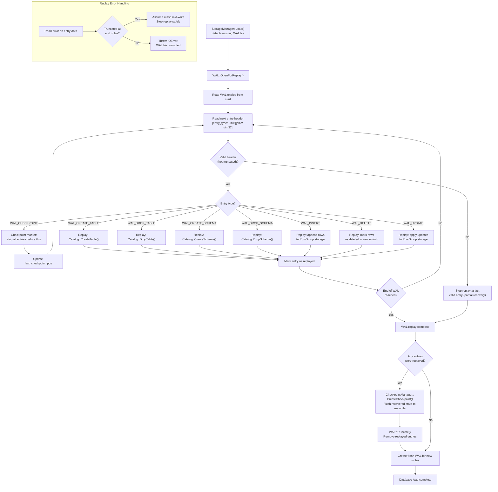

# WAL Replay Flow

## Assumptions
- WAL replay occurs on startup when an existing database file has a WAL file present.
- Only entries past the last checkpoint marker are replayed; earlier entries are already in the file.
- A truncated or corrupted entry at the end of the WAL is treated as a crash during write and replay stops safely.
- After successful replay, a checkpoint is triggered to compact recovered state back to the main file.

## Diagram

## Planned Implementation
- `src/storage/wal_replay.cpp` — WAL replay loop, entry dispatch
- `src/storage/storage_manager.cpp` — StorageManager::Load(), WAL detection
- `src/storage/wal.cpp` — WAL::OpenForReplay(), ReadEntry(), Truncate()
