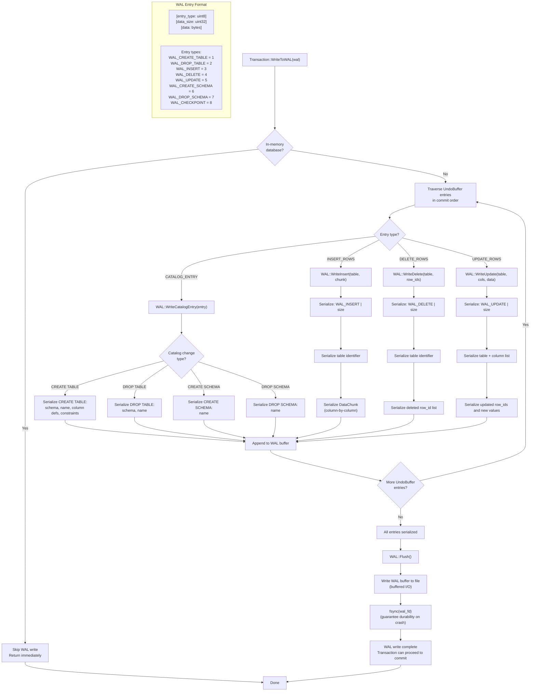

# WAL Write Flow

## Assumptions
- WAL entries are written during commit, before changes are applied to the main storage.
- Each entry has the format: [entry_type: uint8][size: uint32][data: bytes].
- After all entries are written, the WAL is fsynced to guarantee durability.
- In-memory databases skip WAL writes entirely.

## Diagram

## Planned Implementation
- `src/storage/wal.cpp` — WAL::WriteInsert(), WriteDelete(), WriteUpdate(), WriteCatalogEntry(), Flush()
- `src/transaction/transaction.cpp` — Transaction::WriteToWAL()
