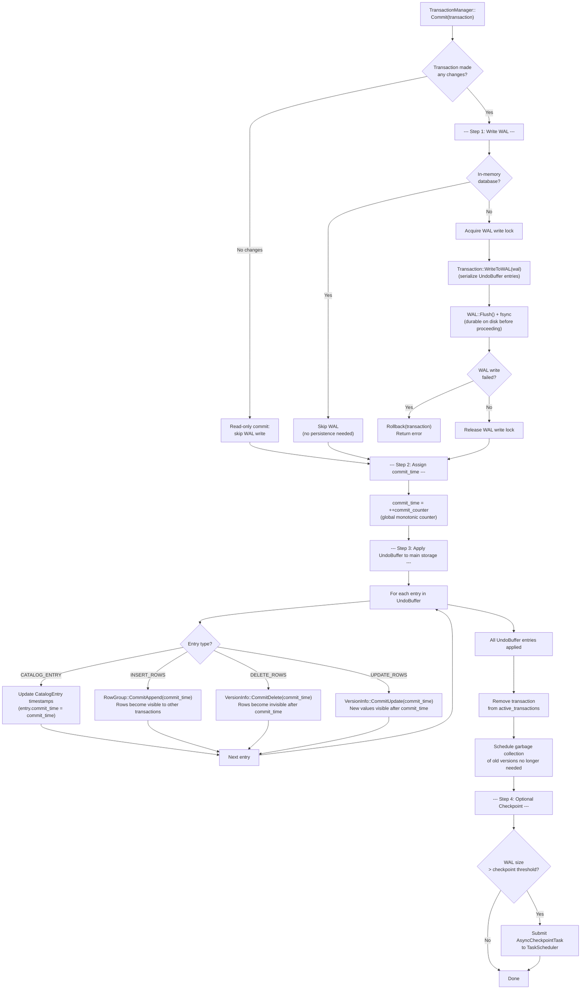

# Transaction Commit Flow

## Assumptions
- Commit writes the WAL first, then applies local changes to main storage, then updates version timestamps.
- After WAL fsync, the transaction is durable even if a crash occurs before the storage update.
- An optional checkpoint may be triggered after commit if the WAL is large enough.

## Diagram

## Planned Implementation
- `src/transaction/transaction_manager.cpp` — TransactionManager::Commit()
- `src/transaction/transaction.cpp` — Transaction::WriteToWAL(), UndoBuffer traversal
- `src/storage/wal.cpp` — WAL::Flush()
- `src/storage/column/row_group.cpp` — RowGroup::CommitAppend()
- `src/storage/column/version_info.cpp` — VersionInfo::CommitDelete(), CommitUpdate()
