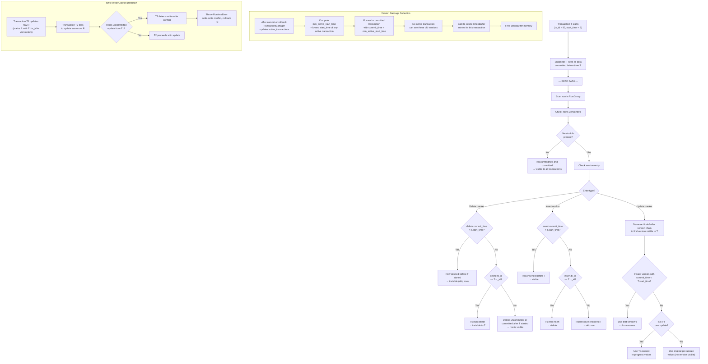

# MVCC Visibility Flow

## Assumptions
- CppColDB uses Multi-Version Concurrency Control (MVCC) with snapshot isolation.
- Each transaction sees a snapshot based on its start_time: all data committed before start_time is visible.
- Version information for rows is stored in VersionInfo structures linked to RowGroups.
- Uncommitted changes are tracked in the UndoBuffer and visible only to the transaction that made them.
- Garbage collection removes old versions when no active transaction needs them.

## Diagram

## Planned Implementation
- `src/storage/column/version_info.cpp` — VersionInfo, delete/insert/update markers
- `src/transaction/undo_buffer.cpp` — UndoBuffer, version chain traversal
- `src/transaction/transaction_manager.cpp` — garbage collection of old versions
- `src/storage/table/row_group.cpp` — RowGroup MVCC filtering during scan
