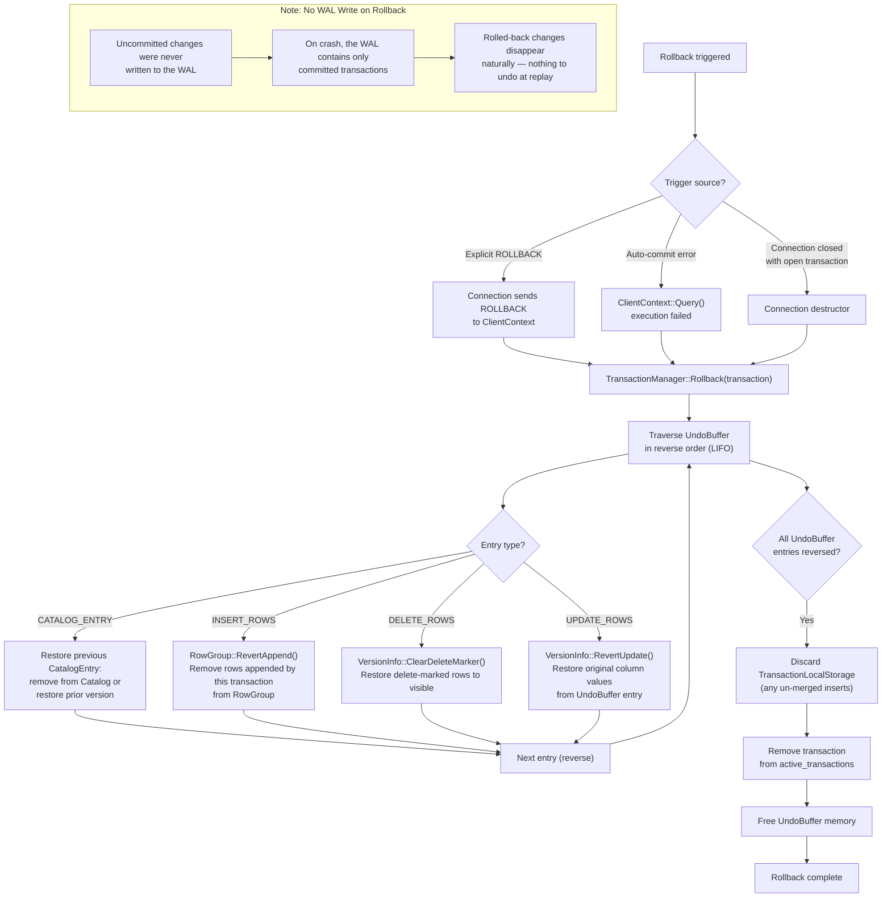

# Transaction Rollback Flow

## Assumptions
- Rollback reverses all local changes using the UndoBuffer, traversed in reverse order.
- Rollback can be triggered explicitly (ROLLBACK statement), on auto-commit error, or on Connection close.
- No WAL entry is written for a rollback; uncommitted changes were never written to WAL.

## Diagram

## Planned Implementation
- `src/transaction/transaction_manager.cpp` — TransactionManager::Rollback()
- `src/transaction/transaction.cpp` — UndoBuffer traversal
- `src/storage/column/row_group.cpp` — RowGroup::RevertAppend()
- `src/storage/column/version_info.cpp` — VersionInfo::ClearDeleteMarker(), RevertUpdate()
