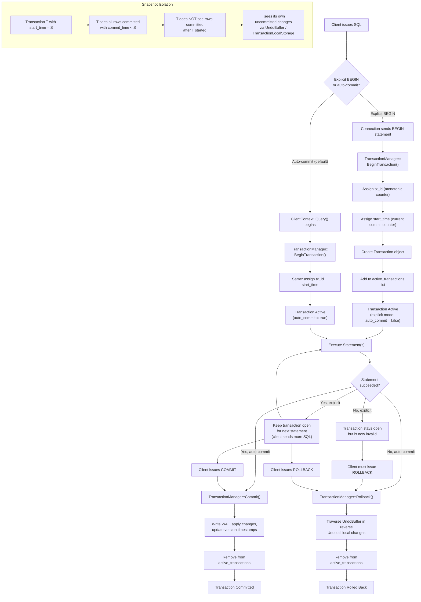

# Transaction Lifecycle Flow

## Assumptions
- CppColDB supports auto-commit (implicit per-statement) and explicit BEGIN/COMMIT/ROLLBACK.
- TransactionManager assigns a monotonically increasing transaction_id and start_time to each transaction.
- Snapshot isolation: a transaction sees all data committed before its start_time.
- A single Transaction object tracks local changes for one session.

## Diagram

## Planned Implementation
- `src/transaction/transaction_manager.cpp` — TransactionManager::BeginTransaction(), Commit(), Rollback()
- `src/transaction/transaction.cpp` — Transaction object, tx_id, start_time, UndoBuffer
- `src/main/client_context.cpp` — auto-commit management around Query()
